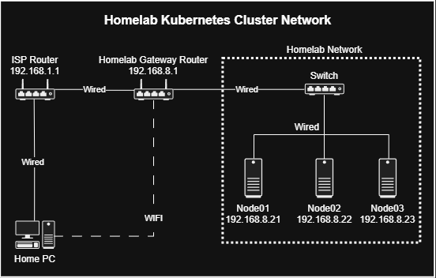

# Ubuntu Server Autoinstall Files

Templates and an interactive script for generating Ubuntu Server Autoinstall
`user-data` and `meta-data` files.

## Templates

- `templates/user-data-template.yaml` contains the Autoinstall and cloud-init
  configuration.
- `templates/meta-data-template.yaml` sets the NoCloud instance ID.

| Variable | Value |
| --- | --- |
| `${HOSTNAME}` | Server hostname |
| `${REALNAME}` | Initial user's display name |
| `${USERNAME}` | Initial user's login name |
| `${PASSWORD_HASH}` | SHA-512 password hash |

Keep these variable names intact when editing the templates.

## Generate Configuration Files

Choose one of the following options.

### Option 1: Manually

Copy the templates to the `output` folder:

```bash
mkdir -p ubuntu_autoinstall/output
cp ubuntu_autoinstall/templates/user-data-template.yaml ubuntu_autoinstall/output/user-data
cp ubuntu_autoinstall/templates/meta-data-template.yaml ubuntu_autoinstall/output/meta-data
```

Generate a password hash:

```bash
openssl passwd -6
```

Replace the variables in `user-data`:

```yaml
# user-data
identity:
  hostname: my-hostname
  realname: My Name
  username: my-username
  password: my-generated-password-hash
```

Set the same hostname as the instance ID in `meta-data`:

```yaml
# meta-data
instance-id: my-hostname
```

### Option 2: Use the Script

[`setup_files.sh`](./setup_files.sh) prompts for the hostname and user details,
then generates both configuration files.

#### Requirements

- `bash`
- `envsubst` from the `gettext-base` package
- `openssl`

```bash
sudo apt update
sudo apt install gettext-base openssl
```

#### Usage

From the repository root, run:

```bash
./ubuntu_autoinstall/setup_files.sh
```

Generated files are written to:

```text
ubuntu_autoinstall/output/
├── user-data
└── meta-data
```

Running the script again overwrites both files.

## Install Ubuntu Server

### Prerequisites

1. The `user-data` and `meta-data` files are ready.
2. An Ubuntu Server installation USB is available.
3. The home PC and nodes are on the same network. (Need a guide? Read my article [on LinkedIn](https://www.linkedin.com/pulse/kubernetes-homelab-part-1-physical-network-rasul-abdulmagomedov-vafwe/))



### Instructions

1. Start an HTTP server and leave the terminal running:

   ```bash
   cd ubuntu_autoinstall/output
   python3 -m http.server 8001
   ```

2. Boot the node from the Ubuntu Server USB.
3. Highlight `Try or Install Ubuntu Server`, then press `e`.
4. Find the line starting with `linux`.
5. Add the following before the final `---`, replacing the IP address with the
   home PC's IP:

   ```text
   autoinstall ds=nocloud-net\;s=http://192.168.8.21:8001/
   ```

   Example:

   ```text
   linux /casper/vmlinuz autoinstall ds=nocloud-net\;s=http://192.168.8.21:8001/ ---
   ```

6. Press `Ctrl+X` or `F10` to boot.
7. After installation, verify the server:

   ```bash
   hostnamectl
   ip -br addr
   ip route
   sudo systemctl status ssh --no-pager
   ping -c 4 ubuntu.com
   ```

8. On the home PC, stop the HTTP server with `Ctrl+C`.
9. Test the SSH connection from the home PC to the node:

   ```bash
   ssh <node-username>@<node-ip>
   ```

> **Note:** Storage is not configured, so the installer may stop at the storage
> screen.

---
## Multiple Nodes (Optional)
Each node uses a dedicated folder containing its own user-data and meta-data files, accessed through a matching NoCloud URL. This keeps node-specific settings organized, prevents configuration mix-ups, and makes multi-node provisioning repeatable.

Create a separate folder for each node:

```text
output/
├── node1/
│   ├── user-data
│   └── meta-data
├── node2/
│   ├── user-data
│   └── meta-data
└── node3/
    ├── user-data
    └── meta-data
```

After starting the HTTP server, use the URL that corresponds to the node you are installing:
```text
autoinstall ds=nocloud-net\;s=http://192.168.8.21:8001/node1/
autoinstall ds=nocloud-net\;s=http://192.168.8.21:8001/node2/
autoinstall ds=nocloud-net\;s=http://192.168.8.21:8001/node3/
```

## Security

Treat generated files as sensitive because `output/user-data` contains the
password hash. 

The repository's `.gitignore` excludes generated output files.
